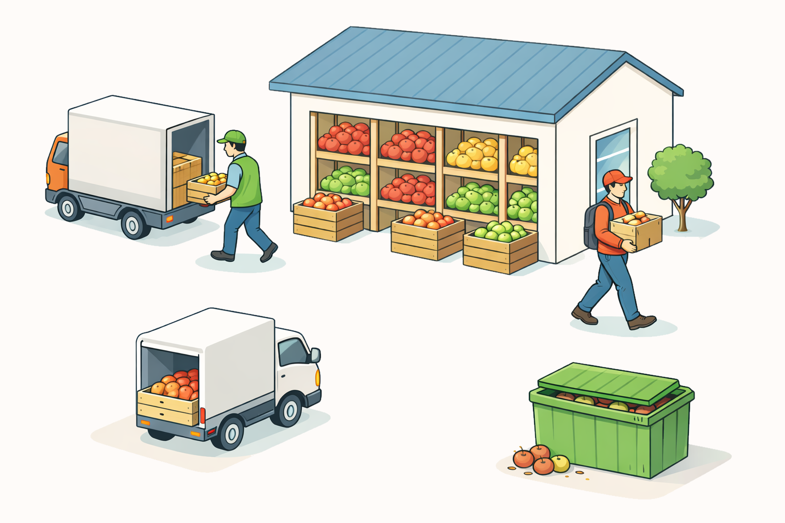

#  Финальный проект: Яблочки.Go

В некоторой стране N местные жители очень любят яблоки, но очень не любят выходить из дома. Компания "Яблекс" решила заработать на этом и запустила в этой стране приложение "Яблочки.Go": оно позволяет клиентам заказывать их любимое лакомство с доставкой прямо домой!

Ваша задача — написать один из сервисов по обработке заказов. Разумеется, это будет высоконагруженный сервис, поэтому без многопоточности тут не обойтись

# Описание предметной области 

Подробнее смотри в документе [DESCRIPTION.md](DESCRIPTION.md)

Есть различные сорта яблок, которые хранятся на складе.

Яблоки поступают на склад партиями от поставщиков. Каждая партия имеет конкретный сорт, количество и срок годности

Потребители яблок (покупатели) оставляют заказы через приложение. Если заказ может быть удовлетворён, наш сервис должен зарезервировать все необходимые яблоки, подтвердить заказ и запустить его доставку. Покупателем важна свежесть яблок, что должно учитываться при обработке заказа

Отправка заказа происходит через взаимодействие с внешним сервисом доставки и может занимать некоторое время. Пока идет доставка, клиент может отменить свой заказ — тогда яблоки возвращаются на склад и это должно быть учтено

У яблок может истечь срок годности, тогда их надо убрать со склада (антисанитария — это плохо!) и отправить на переработку в компостере, который представлен внешним сервисом

# Что нужно сделать

В [service.go](src/service.go) находится частичная реализация сервиса, написанная вашим предшественником. Ваша задача — разобраться, почему сервис очень плохой с точки зрения производительности и эффективности. После этого перепишите этот сервис, чтобы он стал эффективным, потокобезопасным и **полностью** удовлетворял интерфейсам [SupplierApi](src/api/supplier.go) и [ConsumerApi](src/api/consumer.go)

Можно добавлять новые функции, структуры и классы, в существующих и новых файлах, но **нельзя** изменять следующие файлы:

Внешние сервисы (из развивают и пишут другие команды вашей компании):
- [composter.go](src/external_services/composter.go)
- [composter_impl.go](src/external_services/composter_impl.go)
- [delivery.go](src/external_services/delivery.go)
- [delivery_impl.go](src/external_services/delivery_impl.go)

Контракт взаимодействия (поставщики и клиенты будут взаимодействовать с нашим сервисом только через них):
- [consumer.go](src/api/consumer.go)
- [supplier.go](src/api/supplier.go)